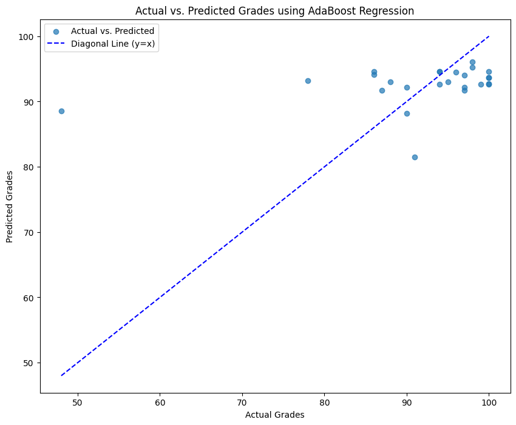

# CS412 Course Project

## Overview

This project focuses on enhancing the performance of a natural language processing (NLP) model for analyzing and predicting scores based on prompts. The primary goal is to explore various techniques related to text preprocessing, feature engineering, model tuning, and experimenting with different models.

## Contributors
- Yağız Toprak Işık 29174

## Table of Contents
- [GradientBoosting](#adaboost)
  - [Model Training](#model-training)
  - [Solution Motivation](#solution-motivation)
  - [Results](#results)
  - [Codes](#codes)

## Model Training:

- The provided code utilizes the XGBoost model for predicting student grades based on prompts. The XGBoost model is configured with n_estimators = 100 and learning_rate = 0.1.
- The model is trained using a subset of the data, specifically X_train and y_train, and subsequently validated on the test set (X_test and y_test).

## Solution Motivation:

- XGBoost is a robust ensemble learning method that combines the predictive power of multiple weak learners, often decision trees, to create a highly accurate and robust predictive model. 
- The key concept behind XGBoost is to sequentially train weak models, focusing on correcting the errors made by the preceding ones. By assigning more weight to misclassified observations in each iteration, XGBoost iteratively enhances its predictive capabilities, contributing to improved overall model performance.

- The model's configuration, with 100 estimators and a learning rate of 0.1, reflects a balance between model complexity and generalization. The use of cross-validation provides a robust assessment of the model's performance across various subsets of the combined training and test data, offering insights into its ability to generalize to unseen data.

- The iterative and boosting nature of XGBoost makes it well-suited for capturing complex relationships within the data while mitigating overfitting. The provided code not only trains the model but also evaluates its performance through cross-validation, contributing to a more comprehensive understanding of its predictive capabilities.

### Results
- The GradientBoosting model was trained and evaluated, producing the following results:

```plaintext
Cross-Validation R2 Scores: [0.99046837 0.66777219 0.55252456 0.97269405 0.79382785]
Mean R2 Score: 0.7954574044560845

XGBoost - MSE Train: 0.0021904191782652427
XGBoost - MSE TEST: 30.330423434854602
XGBoost - R2 Train: 0.9999865964105298
XGBoost - R2 TEST: 0.7298333288660587
```

- These metrics provide insights into the model's performance on both the training and test sets. The Mean Squared Error (MSE) values indicate the average squared difference between predicted and actual values, while the R-squared (R2) values measure the proportion of variance explained by the model.

- The achieved R2 scores, particularly 0.9999 for the training set and 0.729 for the test set, demonstrate a high level of predictive accuracy. These results suggest that the AdaBoost model effectively captures the relationships within the data, providing reliable predictions.



### Codes

```python

import xgboost as xgb
from sklearn.model_selection import cross_val_score, KFold
from sklearn.metrics import mean_squared_error, r2_score
import matplotlib.pyplot as plt
import numpy as np

# Assuming you have already loaded your data and split it into X_train, X_test, y_train, and y_test

# Create XGBoost model
xgb_model = xgb.XGBRegressor(objective='reg:squarederror', n_estimators=100, learning_rate=0.1, random_state=42)

# Combine your training and test sets for cross-validation
X_combined = np.concatenate((X_train, X_test), axis=0)
y_combined = np.concatenate((y_train, y_test), axis=0)

# Set up K-fold cross-validation
kf = KFold(n_splits=5, shuffle=True, random_state=42)

# Perform cross-validation
cv_results = cross_val_score(xgb_model, X_combined, y_combined, cv=kf, scoring='r2')

# Print cross-validation results
print("Cross-Validation R2 Scores:", cv_results)
print("Mean R2 Score:", np.mean(cv_results))

# Fit the model to the training data
xgb_model.fit(X_train, y_train)

# Prediction
y_train_pred_xgb = xgb_model.predict(X_train)
y_test_pred_xgb = xgb_model.predict(X_test)

# Calculation of Mean Squared Error (MSE)
print("XGBoost - MSE Train:", mean_squared_error(y_train, y_train_pred_xgb))
print("XGBoost - MSE TEST:", mean_squared_error(y_test, y_test_pred_xgb))

print("XGBoost - R2 Train:", r2_score(y_train, y_train_pred_xgb))
print("XGBoost - R2 TEST:", r2_score(y_test, y_test_pred_xgb))

# Plot actual vs. predicted values with diagonal line
plt.scatter(y_test, y_test_pred_xgb, alpha=0.7, label='Actual vs. Predicted (XGBoost)')
plt.plot(np.linspace(min(y_test), max(y_test), 100), np.linspace(min(y_test), max(y_test), 100), '--', color='blue', label='Diagonal Line (y=x)')

plt.xlabel("Actual Grades")
plt.ylabel("Predicted Grades")
plt.title("Actual vs. Predicted Grades using XGBoost Regression")
plt.legend()
plt.show()

```

