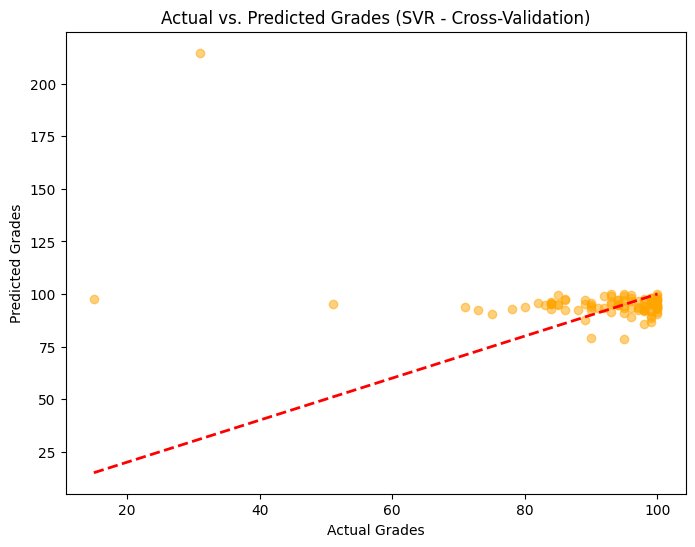
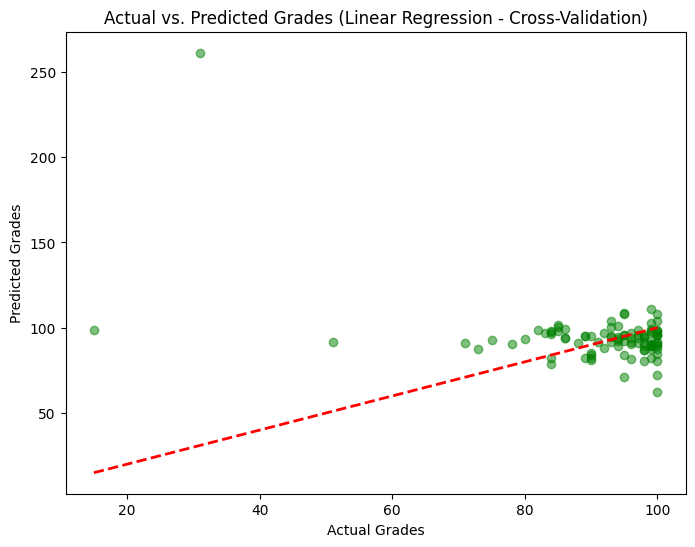

# CS412 Course Project

## Overview

This project focuses on enhancing the performance of a natural language processing (NLP) model for analyzing and predicting scores based on prompts. The primary goal is to explore various techniques related to text preprocessing, feature engineering, model tuning, and experimenting with different models.

## Contributors
- Gorkem Topcu

## Table of Contents
- [Linear Regression](#linear-regression)
  - [Model Training](#model-training)
  - [Solution Motivation](#solution-motivation)
  - [Results](#results)
  - [Code](#code)

## Support Vector Regressor

### Model Training
- The program uses Support Vector Regression (SVR) with a linear kernel (kernel='linear') and a regularization parameter (C=1.0).
- The SVR model is trained on the provided training data (X_train, y_train) using the fit method.
- The trained SVR model is used to make predictions on both the training set (y_train_pred) and the test set (y_test_pred).
- Mean Squared Error (MSE) and R-squared (R2) are calculated to evaluate the performance of the model on both the training and test sets.
- k-fold cross-validation (cv=5) is applied to the training set using cross_val_predict. It provides cross-validated predictions (y_cv_pred_svr), which are used to evaluate the performance of the model during training.
- MSE and R2 scores are computed for the cross-validated predictions to assess the model's generalization performance.

### Solution Motivation
- The program utilizes Support Vector Regressor (SVR), specifically with a linear kernel and C=1.0, for predicting student grades based on input features.
- The SVR model is trained on a subset of the data (X_train and y_train) and evaluated on both the training and test sets.
- Cross-validation is applied to obtain more reliable performance metrics, considering different subsets of the training data.

### Results
- The Support Vector Regressor model was trained and evaluated, producing the following results:
```plaintext
Test Set Performance (SVR):
Mean Squared Error(Train): 129.45437423099355
Mean Squared Error(Test): 122.81119238753843
R2 Score(Train): -0.09393431636706562
R2 Score(Test): -0.09393431636706562
```

- MSE measures the average squared difference between predicted and actual values. In this case, the relatively high MSE values suggest that the SVR model struggles to make accurate predictions, indicating a substantial amount of error.
- The R2 score represents the proportion of variance in the target variable explained by the model. A negative R2 score indicates that the model performs poorly and provides worse predictions than a simple mean-based predictor.





### Code
```python
# Create an SVR model
svr_model = SVR(kernel='linear', C=1.0)

# Fit the SVR model on the training data
svr_model.fit(X_train, y_train)

# Make predictions on the test set
y_train_pred = svr_model.predict(X_train)
y_test_pred = svr_model.predict(X_test)

# Evaluate the model
mse_train = mean_squared_error(y_train, y_train_pred)
mse_test = mean_squared_error(y_test, y_test_pred)
r2_train = r2_score(y_train, y_train_pred)
r2_test = r2_score(y_test, y_test_pred)

# Apply k-fold cross-validation with SVR
y_cv_pred_svr = cross_val_predict(svr_model, X_train, y_train, cv=5)

# Evaluate performance using cross-validated predictions
mse_cv_svr = mean_squared_error(y_train, y_cv_pred_svr)
r2_cv_svr = r2_score(y_train, y_cv_pred_svr)