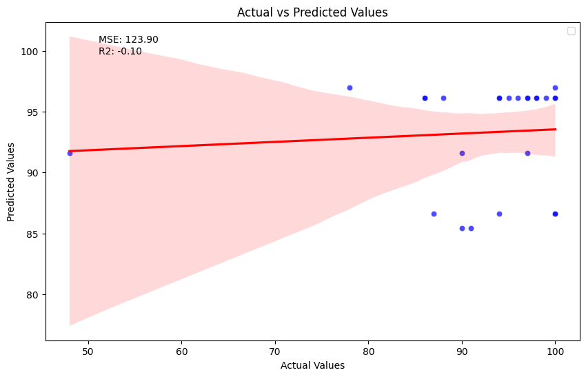

# CS412 Course Project

## Overview

This project focuses on enhancing the performance of a natural language processing (NLP) model for analyzing and predicting scores based on prompts. The primary goal is to explore various techniques related to text preprocessing, feature engineering, model tuning, and experimenting with different models.

## Contributors
- Can Zunal 29453

## Table of Contents
- [Decision Tree Regressor](#decision-tree-regressor)
  - [Model Training](#model-training)
  - [Solution Motivation](#solution-motivation)
  - [Results](#results)
  - [Codes](#codes)

## Decision Tree Regressor

### Model Training
- The Decision Tree Regressor is utilized for predicting student grades based on the provided features.
- The regressor is configured with a squared error criterion and a maximum depth of 5.
- The model is trained on the training data (X_train and y_train) using the `fit` method.

### Solution Motivation
- It will be used as a baseline to improve upon as it is the improved version of what the instructor has given.
- Decision Tree Regressor is chosen for its ability to capture non-linear relationships in the data.
- The squared error criterion and limited maximum depth help prevent overfitting while allowing the model to learn meaningful patterns.

### Results
- The Decision Tree Regressor model was trained and evaluated, producing the following results:

```plaintext
MSE Train: 23.792569028909234
MSE TEST: 123.90309194337131
R2 Train: 0.8544087675690079
R2 TEST: -0.1036603549383901
```

The R-squared score represents the proportion of variance in the dependent variable (grades) explained by the model. A score of 1.0 indicates a perfect fit. In the training set, the R2 score is exceptionally high at 0.8544087675690079, suggesting an almost perfect fit to the training data. However, on the test set, the R2 score is -0.1036603549383901.

In summary, while the Decision Tree Regressor demonstrates outstanding performance on the training set, there is a noticeable drop in performance on the test set, suggesting the need for further investigation into potential overfitting and generalization issues.



### Codes

```python
regressor = DecisionTreeRegressor(random_state= 42,criterion='squared_error', max_depth=5)
regressor.fit(X_train, y_train)

extracted_MSEs = regressor.tree_.impurity   
for idx, MSE in enumerate(regressor.tree_.impurity):
    print("Node {} has MSE {}".format(idx,MSE))

# Prediction
y_train_pred = regressor.predict(X_train)
y_test_pred = regressor.predict(X_test)

# Calculation of Mean Squared Error (MSE)
print("MSE Train:", mean_squared_error(y_train,y_train_pred))
print("MSE TEST:", mean_squared_error(y_test,y_test_pred))

print("R2 Train:", r2_score(y_train,y_train_pred))
print("R2 TEST:", r2_score(y_test,y_test_pred))

# Assuming y_test and y_test_pred are your actual and predicted values for the test set
plt.figure(figsize=(10, 6))

# Create a scatter plot
sns.scatterplot(x=y_test, y=y_test_pred, color='blue', alpha=0.7)

# Add a regression line
sns.regplot(x=y_test, y=y_test_pred, scatter=False, color='red', line_kws={'label':'Regression Line'})

# Add labels and title
plt.title('Actual vs Predicted Values')
plt.xlabel('Actual Values')
plt.ylabel('Predicted Values')

# Calculate and display performance metrics
mse = mean_squared_error(y_test, y_test_pred)
r2 = r2_score(y_test, y_test_pred)
plt.text(0.1, 0.9, f'MSE: {mse:.2f}\nR2: {r2:.2f}', transform=plt.gca().transAxes)

# Show legend
plt.legend()

# Show the plot
plt.show()

```
