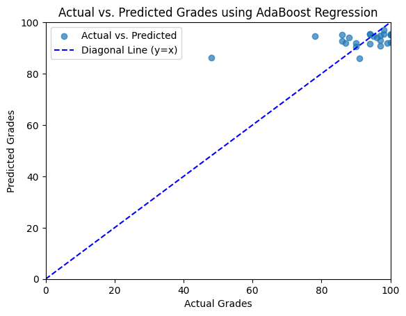

# CS412 Course Project

## Overview

This project focuses on enhancing the performance of a natural language processing (NLP) model for analyzing and predicting scores based on prompts. The primary goal is to explore various techniques related to text preprocessing, feature engineering, model tuning, and experimenting with different models.

## Contributors
- Fikret Kayra Yilmaz 29371
- Gorkem Topcu 28862

## Table of Contents
- [Linear Regression](#linear-regression)
  - [Model Training](#model-training)
  - [Solution Motivation](#solution-motivation)
  - [Results](#results)

## Linear Regression

### Model Training
- The program utilizes Linear Regression, a simple yet effective regression model, to predict student grades based on the provided features.
- The model is trained on a subset of the data (X_train and y_train) and evaluated on both the training and test sets.
- Cross-validation is applied to obtain more reliable performance metrics, considering different subsets of the training data.

### Solution Motivation
- Linear Regression is a suitable choice for predicting numeric values (like grades) based on input features.
- The approach is useful as it provides a baseline model to understand the relationship between input features and grades.
- Cross-validation ensures that the model's performance is not overly optimistic or pessimistic, providing a more accurate assessment.
- The simplicity of Linear Regression makes it interpretable, helping to identify the most influential features on the predicted grades.

### Results
- The Linear Regression model was trained and evaluated, producing the following performance metrics:
```plaintext
Mean Squared Error(Train): 100.87553202163336
Mean Squared Error(Test): 135.36989735207453
R2 Score(Train): 0.3827235297156596
R2 Score(Test): -0.20580032843608853
```
- Mean Squared Error (MSE) is a measure of the average squared difference between the predicted and actual values. For the training set, the MSE is 100.88, and for the test set, it is 135.37. These values suggest a relatively high level of error in the model's predictions.
- R-squared (R2) score represents the proportion of variance in the target variable that is explained by the model. A positive R2 score indicates that the model explains some of the variability in the data. For the training set, the R2 score is 0.38, suggesting that the model captures a portion of the variance. However, for the test set, the R2 score is negative (-0.21), indicating that the model performs worse than a simple mean-based predictor.
  



### Code
```python
# Create a linear regression model
model = LinearRegression()

# Train the model
model.fit(X_train, y_train)

# Make predictions on the train set
y_train_pred = model.predict(X_train)

# Make predictions on the test set
y_test_pred = model.predict(X_test)

# Evaluate the model
mse_train = mean_squared_error(y_train, y_train_pred)
r2_train = r2_score(y_train, y_train_pred)
mse_test = mean_squared_error(y_test, y_test_pred)
r2_test = r2_score(y_test, y_test_pred)
