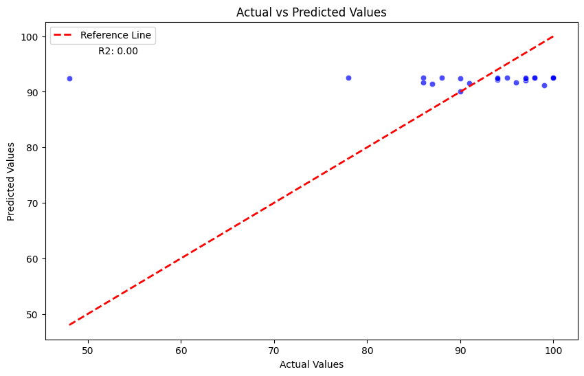

# CS412 Course Project

## Overview

This project focuses on enhancing the performance of a natural language processing (NLP) model for analyzing and predicting scores based on prompts. The primary goal is to explore various techniques related to text preprocessing, feature engineering, model tuning, and experimenting with different models.

## Contributors
- Berk Ay 29026

## Table of Contents
- [AdaBoost](#adaboost)
  - [Model Training](#model-training)
  - [Solution Motivation](#solution-motivation)
  - [Results](#results)
  - [Codes](#codes)

## Neural Network

### Model Training
- The code employs an AdaBoost model for predicting student grades based on prompts.
  - The model is created with n_estimators = 100 and learning_rate = 0.75.
  - The model is trained on a subset of the data (X_train and y_train) and validated on X_test and y_test.

### Solution Motivation
- AdaBoost focuses on combining multiple weak learners (simple models) to form a strong learner.
- The key idea behind AdaBoost is to focus on the weaknesses of individual models and give more weight to the observations that are misclassified by previous models. 
- This iterative process helps improve overall model performance.
- 
### Results
- The AdaBoost model was trained and evaluated, producing the following results:

```plaintext
MSE Train: 0.7160604006452509
MSE TEST: 12.665975190894672
R2 Train: 0.9956182909000579
R2 TEST: 0.8871784839621872
```

- These metrics provide insights into the model's performance on both the training and test sets. The Mean Squared Error (MSE) values indicate the average squared difference between predicted and actual values, while the R-squared (R2) values measure the proportion of variance explained by the model.

- The achieved R2 scores, particularly 0.9956 for the training set and 0.8871 for the test set, demonstrate a high level of predictive accuracy. These results suggest that the AdaBoost model effectively captures the relationships within the data, providing reliable predictions.


### Codes

```python
from sklearn.ensemble import AdaBoostRegressor
from sklearn.metrics import mean_squared_error, r2_score
import matplotlib.pyplot as plt
import numpy as np
from sklearn.model_selection import cross_val_predict

# Create AdaBoostRegressor model
adaboost_model = AdaBoostRegressor(n_estimators=100, learning_rate=0.75, random_state=42)

# Fit the model to the training data
adaboost_model.fit(X_train, y_train)

# Prediction
y_train_pred = adaboost_model.predict(X_train)
y_test_pred = adaboost_model.predict(X_test)

# Calculation of Mean Squared Error (MSE)
print("MSE Train:", mean_squared_error(y_train,y_train_pred))
print("MSE TEST:", mean_squared_error(y_test,y_test_pred))

print("R2 Train:", r2_score(y_train,y_train_pred))
print("R2 TEST:", r2_score(y_test,y_test_pred))

# Set the figure size
plt.figure(figsize=(10, 8))

# Plot actual vs. predicted values with diagonal line
plt.scatter(y_test, y_test_pred, alpha=0.7, label='Actual vs. Predicted')
plt.plot(np.linspace(min(y_test), max(y_test), 100), np.linspace(min(y_test), max(y_test), 100), '--', color='blue', label='Diagonal Line (y=x)')

plt.xlabel("Actual Grades")
plt.ylabel("Predicted Grades")
plt.title("Actual vs. Predicted Grades using AdaBoost Regression")
plt.legend()
plt.show()

# Perform cross-validated predictions
y_cv_pred = cross_val_predict(adaboost_model, X, y, cv=5)  # 5-fold cross-validation

# Evaluate the cross-validated predictions
cv_mse = mean_squared_error(y, y_cv_pred)
cv_r2 = r2_score(y, y_cv_pred)

print("Cross-Validated MSE:", cv_mse)
print("Cross-Validated R2 Score:", cv_r2)


```
